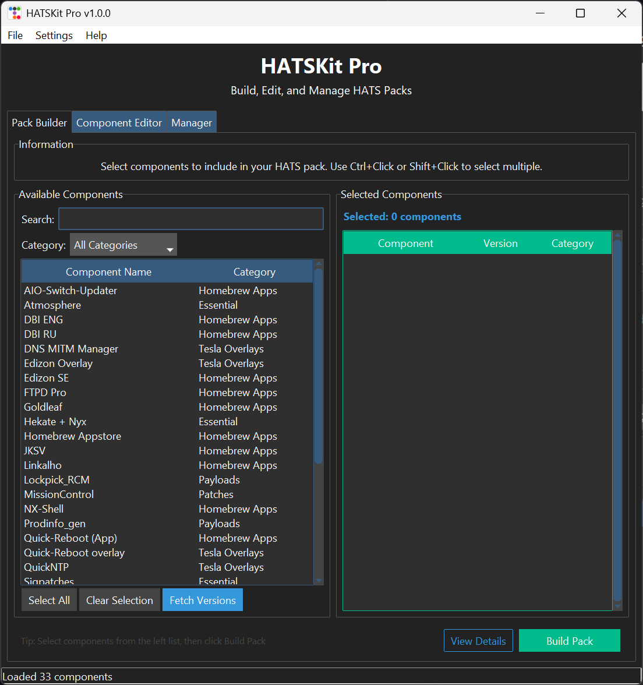

# HATSKit Pro

A unified tool for building and managing HATS packs for Nintendo Switch CFW.

<div align="center">
  
</div>

## Overview

HATSKit Pro is a comprehensive Windows application that simplifies the process of creating, editing, and managing HATS (Homebrew Application Title Server) packs for Nintendo Switch custom firmware. With an intuitive graphical interface, you can easily build custom packs, edit component definitions, and manage installed components on your SD card.

## Features

### Pack Builder
- Select from a library of available components
- Search and filter components by category
- Preview selected components before building
- Fetch latest version information from GitHub
- Build custom HATS packs with your chosen components
- Automatic version detection and download

### Component Editor
- View and edit component definitions
- Add new components to the library
- Configure download sources (GitHub releases or direct URLs)
- Define processing steps for each component
- Manage component metadata (name, category, description)
- Support for multiple source types and asset patterns

### Pack Manager
- Download official HATS packs directly from GitHub
- Install packs to your SD card with one click
- View installed components with detailed information
- Move components to trash bin for safe removal
- Restore components from trash bin
- Automatic SD card path detection

### Additional Features
- Built-in GitHub API integration with PAT support
- Configurable download chunk sizes for optimal performance
- Dark theme UI powered by ttkbootstrap
- Comprehensive error handling and user feedback
- Persistent configuration storage

## Installation

### Using the Python Launcher (Recommended)

1. Download the latest release from the [Releases page](https://github.com/sthetix/HATSKitPro/releases)
2. Extract the downloaded archive to your desired location
3. Double-click `HATSKitPro.exe` to launch the application

**That's it!** The launcher will automatically:
- Check if Dot.net is installed on your system
- Install Dot.net if it's not present
- Check if Python is installed on your system
- Install Python if it's not present
- Install all required dependencies (`ttkbootstrap`, `requests`)
- Launch HATSKit Pro

No manual setup or command-line operations required!

### Manual Installation (Advanced Users)

If you prefer to run from source:

1. Clone the repository:
```bash
git clone https://github.com/sthetix/HATSKitPro.git
cd HATSKit-Pro
```

2. Install Python 3.8 or higher (if not already installed)

3. Install required dependencies:
```bash
pip install ttkbootstrap requests
```

4. Run the application:
```bash
python hatskitpro.py
```

## Usage

### First Time Setup

1. **Configure GitHub Personal Access Token (Optional but Recommended)**
   - Go to `Settings > GitHub PAT`
   - Enter your GitHub Personal Access Token
   - This increases API rate limits and enables faster version checking
   - Token is securely stored in `config.json`

2. **Set Your SD Card Path**
   - Navigate to the `Manager` tab
   - Click `Browse...` to select your SD card location
   - Or manually enter the path (e.g., `E:\` or `F:\`)

### Building a Custom Pack

1. Go to the `Pack Builder` tab
2. Browse or search for components you want to include
3. Use the category filter to narrow down options
4. Select components from the left list (use Ctrl+Click or Shift+Click for multiple)
5. Preview your selections in the right panel
6. Click `Fetch Versions` to get the latest version information (optional)
7. Click `Build Pack` to create your custom HATS pack
8. The pack will be saved as `HATS-[date]-[time].zip`

### Installing a Pack

1. Go to the `Manager` tab
2. **Option A - Download Official Pack:**
   - Click `Refresh` to check for the latest official release
   - Click `Download Latest` to download the official HATS pack
   - Wait for the download to complete
   
3. **Option B - Use Custom Pack:**
   - Click `Select Pack (.zip)...` to choose your custom built pack
   - Or the path will be automatically set after building a pack

4. Ensure your SD card path is set
5. Click `Install to SD Card`
6. Wait for installation to complete

### Managing Components

1. Go to the `Manager` tab
2. View all installed components in the list
3. Select components you want to remove (use Ctrl+Click or Shift+Click)
4. Click `Move to Trash` to safely remove them
5. Switch to `Trash Bin` view to restore components if needed

### Editing Components

1. Go to the `Component Editor` tab
2. Select a component from the list
3. Edit the component details:
   - Basic information (name, category, description)
   - Source type (GitHub release or direct URL)
   - Repository information and asset patterns
   - Processing steps for extraction and placement
4. Click `Save Changes` to update the component definition
5. Use `Add New` to create new component entries

## Configuration

### config.json

Stores application settings:
- `github_pat`: Your GitHub Personal Access Token (optional)
- `download_chunk_size`: Download chunk size in bytes (default: 2MB)

### components.json

Contains all component definitions including:
- Component metadata
- Download sources
- Version information
- Processing instructions

### manifest.json

Tracks the last built pack information for reference.

## File Structure

```
HATSKit-Pro/
│
├── hatskitpro.py          # Main application entry point
├── HATSKitPro.exe         # Python launcher executable
├── config.json            # Application configuration (not in repo)
├── components.json        # Component definitions (not in repo)
├── manifest.json          # Last build information (not in repo)
│
├── src/
│   ├── builder.py         # Pack builder module
│   ├── editor.py          # Component editor module
│   └── manager.py         # Pack manager module
│
├── assets/
│   └── skeleton.zip       # Base pack structure
│
├── image/
│   └── preview.png        # Application preview image
│
└── README.md              # This file
```

## System Requirements

- **Operating System:** Windows 7/8/10/11 (64-bit)
- **Python:** 3.8 or higher (automatically installed by launcher)
- **Memory:** 2GB RAM minimum
- **Storage:** 100MB free space (plus space for packs)
- **Internet:** Required for downloading components and official packs

## GitHub API Rate Limits

Without authentication, GitHub API limits you to 60 requests per hour. With a Personal Access Token:
- Increases to 5,000 requests per hour
- Enables faster component version checking
- Required for heavy usage

### Creating a GitHub PAT

1. Go to [GitHub Settings > Developer settings > Personal access tokens](https://github.com/settings/tokens)
2. Click "Generate new token (classic)"
3. Give it a descriptive name (e.g., "HATSKit Pro")
4. No special scopes/permissions needed for public repositories
5. Click "Generate token"
6. Copy the token and paste it in HATSKit Pro settings

## Troubleshooting

### Application won't launch
- Ensure you're running `HATSKitPro.exe` launcher, not the Python script directly
- Check if antivirus software is blocking the application
- Try running as administrator

### Components won't download
- Check your internet connection
- Verify your GitHub PAT is valid (if using one)
- Check if you've hit GitHub API rate limits
- Try again later or with a PAT configured

### Installation fails
- Ensure your SD card path is correct
- Check that the SD card is not write-protected
- Verify you have sufficient space on the SD card
- Make sure the SD card is formatted as FAT32 or exFAT

### Can't find my SD card
- Ensure the SD card is properly inserted
- Check Windows Explorer for the drive letter
- Try using a different USB port or card reader

## Contributing

Contributions are welcome! Please feel free to submit issues, feature requests, or pull requests.

## License

This project is provided as-is for educational and personal use. Please respect the licenses of individual components included in HATS packs.

## Disclaimer

This tool is designed for use with homebrew and legally obtained software. Users are responsible for ensuring their usage complies with applicable laws and terms of service. The developers assume no liability for misuse of this software.

## Acknowledgments

- Built with [ttkbootstrap](https://github.com/israel-dryer/ttkbootstrap) for the modern UI
- Component sources from various homebrew developers
- Nintendo Switch homebrew community

## Support

For issues, questions, or suggestions:
- Open an issue on [GitHub Issues](https://github.com/sthetix/HATSKitPro/issues)
- Check existing issues for solutions
- Provide detailed information when reporting bugs


---

**Made with ❤️ for the Nintendo Switch homebrew community**